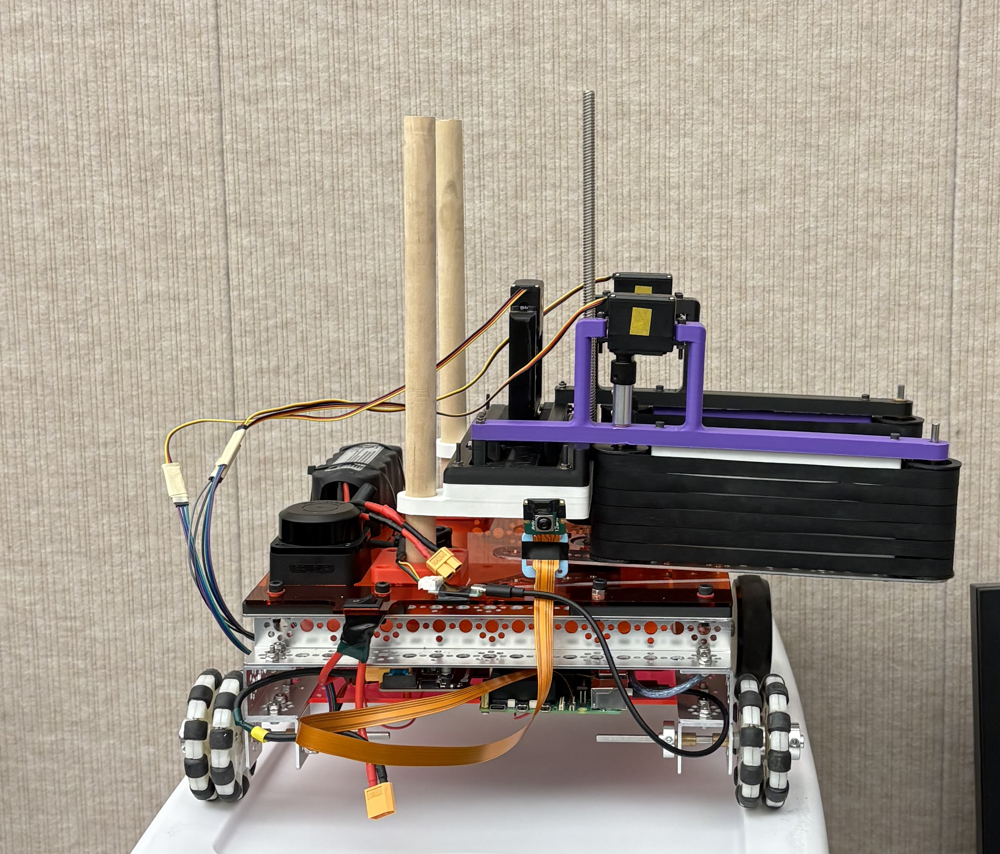

# Project NUEVO: Autonomous Burger Assembly & Delivery



## Project Overview
Project-NUEVO is a modular two-wheeled mobile robot engineered to autonomously assemble and deliver burgers in a tight kitchen environment. Built on a dual-layer control architecture, the system navigates a complex course, recognizes traffic signals, performs multi-stage mechanical manipulation at specific kitchen stations, avoids physical obstacles using dynamic path planning, and uses biometric facial recognition to deliver the final product to the correct customer.

## Problem
Automating kitchen assembly requires high precision in incredibly constrained spaces. Standard front-wheel drive and head-on manipulation designs proved prone to collision and required too much space to maneuver. Furthermore, the robot required a robust software architecture capable of handling heavy computer vision tasks (like YOLO and facial recognition) simultaneously with real-time motor control and obstacle avoidance, all without overwhelming the onboard Raspberry Pi 5.

## Design And Approach

### Mechanical
* **Drive Configuration:** Converted the chassis from Front-Wheel Drive (FWD) to Rear-Wheel Drive (RWD) to improve turning dynamics, stability, and spatial efficiency.
* **Drive-By Manipulation:** Designed a left-mounted, raised sideways claw. Instead of driving head-on into the counter, the robot shifts into a parallel drive lane (X = -180.0) and uses a custom stepper-driven elevator to reach *over* the counter, eliminating chassis collision risks.

### Electrical
* **Actuation:** Driven by DC motors for the main chassis, paired with a precision stepper motor for the elevation lift and servos for the gripper.
* **Custom PCB:** Integrates the Arduino, motor drivers, and power management into a standardized interface for maximum reproducibility.
* **Sensors:** Integrated front-focused LiDAR (filtered to a 110-degree FOV) for spatial mapping and a loopback camera device for visual processing.

### Software
* **Master FSM (ROS 2):** Engineered a highly threaded Finite State Machine handling distinct sequences for bottom buns, patties, top buns, and a two-stage delivery handoff to prevent payload drops.
* **Navigation:** Implemented Leashed Artificial Potential Fields (LAPF) to project a virtual "leash" that safely guides the RWD geometry through tight obstacle corridors, bypassing the physical limitations of standard pure pursuit algorithms.
* **Vision Pipeline:** Centralized all visual processing into a single ROS 2 `vision_node`. It utilizes YOLO (NCNN) for real-time traffic light and stop sign detection, and a `face_recognition` service (dlib) that runs on-demand to identify biometric targets without bottlenecking CPU performance during motion.
* **Low-Level Control:** Real-time embedded C++ on Arduino handling UART communication, GPIO, and precise motor state execution.

## Results
* **Navigation:** The switch to LAPF completely resolved previous "blind nose" collision bugs associated with the RWD geometry, successfully maneuvering the robot through the LiDAR obstacle section.
* **Vision & State Management:** Successfully decoupled heavy `dlib` facial encoding from the main control loop by placing it behind a triggered ROS 2 service, maintaining a stable, high FSM tick rate and fast YOLO inference times during active driving.
* **Manipulation:** The two-stage delivery sequence (prepping the burger at a shared waypoint before executing the final shelf approach) significantly increased delivery success rates by preventing mid-turn payload drops.

## How To Reproduce & Quick Demo Run Guide

### 1. Sync Latest Code (On the Pi Host)
Run from the Raspberry Pi host, not inside Docker:
```bash
cd ~/Project-NUEVO
git status
git pull origin main
./ros2_ws/docker/restart.sh rpi

```

### 2. Open Three Docker Terminals

In each terminal, initialize the ROS 2 environment:

```bash
cd ~/Project-NUEVO
./ros2_ws/docker/enter_ros2.sh rpi

```

### 3. Terminal 1 - LiDAR

```bash
ros2 launch rplidar_ros rplidar_c1.launch.py

```

*(Quick check from another terminal: `ros2 topic echo /scan --once`)*

### 4. Terminal 2 - Vision + Facial Recognition

```bash
ros2 launch vision vision_debug.launch.py

```

*(Quick check from another terminal: `ros2 service call /vision/capture_target std_srvs/srv/Trigger` -> Expected face result: success=True and message="guy.jpg" or "girl.jpg")*

### 5. Terminal 3 - Run the Robot

```bash
ros2 service call /set_firmware_state bridge_interfaces/srv/SetFirmwareState "{target_state: 2}"
ros2 run robot robot

```

Then press **BTN_1** to start the demo.

### Expected Demo Flow

`IDLE` -> `BTN_1` -> Turn left 15 deg -> Wait for green light -> Kitchen assembly -> Face scan -> Delivery -> Turn right 25 deg -> Stop sign scan -> `STOP`.

## Fast Troubleshooting

| Problem | Command / Fix |
| --- | --- |
| **No robot executable** | `cd ~/ros2_ws && colcon build --packages-select robot --symlink-install && source install/setup.bash && ros2 pkg executables robot` |
| **Vision capture missing** | Start vision: `ros2 launch vision vision_debug.launch.py`; Check: `ros2 service list |
| **No /scan topic** | Start LiDAR: `ros2 launch rplidar_ros rplidar_c1.launch.py`; Host check: `ls -l /dev/rplidar` |
| **Camera missing** | Host: `cd ~/Project-NUEVO && ./ros2_ws/host_camera/check.sh`; Expected `/dev/video10` |
| **Bridge not responding** | Host: `curl http://localhost:8000/health`; Docker: `ros2 topic echo /sys_state --once` |
| **Code changes not reflected** | Host: `./ros2_ws/docker/restart.sh rpi`; Rebuild robot/vision inside Docker if needed. |
| **Emergency stop** | Press **BTN_2** or call SetFirmwareState `target_state: 4` |

*Minimum Pass Check: `/bridge`, `/vision_node`, `/scan`, `/vision/detections`, `/vision/capture_target`, and `/sys_state` must be available.*

## Team Contributions

| Member | Contributions |
| --- | --- |
| **Isaac Ho** | Controls, Hardware Debugging, Software Architecture, State Machine Logic, ROS 2 Vision Pipeline, LAPF System Testing, Repository Structuring, Gallery Integration, System Refinement. |
| **Jenise Hurtado** | Controls, Electrical Wiring, Hardware Debugging, Documentation, Manipulator Validation, System Refinement. |
| **Neyvary Paredes** | Controls, Electrical Wiring, Hardware Debugging, Documentation, Manipulator Validation, System Refinement. |
| **Jeremy Shen** | Mechanical Design, Assembly, Prototyping. |
| **Shirley Xiang** | Controls, Documentation, LAPF System Testing, System Refinement. |
| **Sophia Wang** | Mechanical Design, Assembly, Prototyping. |

## Repository Structure & Documentation

```text
├── firmware/       Arduino firmware and firmware-specific docs
├── nuevo_ui/       Raspberry Pi bridge + web UI
├── ros2_ws/        ROS2 workspace and Pi-side tests
├── tlv_protocol/   TLV type definitions, payload schemas, generators
├── NUEVO board/    PCB design files (schematics, layouts, BOM)
├── mechanical/     CAD files for chassis and manipulators
├── docs/           Cross-project architecture, protocol, and design docs
└── assets/         Shared repo assets

```

| Document | Purpose |
| --- | --- |
| [docs/README.md](https://github.com/isaacscho/Project-NUEVO/blob/main/docs/README.md) | Cross-project documentation map and source-of-truth index |
| [docs/COMMUNICATION_PROTOCOL.md](https://github.com/isaacscho/Project-NUEVO/blob/main/docs/COMMUNICATION_PROTOCOL.md) | Protocol behavior, framing, and logical TLV design |
| [firmware/README.md](https://github.com/isaacscho/Project-NUEVO/blob/main/firmware/README.md) | Arduino firmware overview and build instructions |
| [NUEVO board/SPECIFICATIONS.md](https://github.com/isaacscho/Project-NUEVO/blob/main/nuevo_board/SPECIFICATIONS.md) | PCB hardware specifications |
